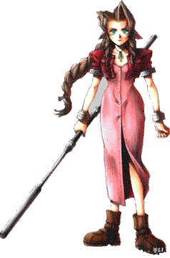
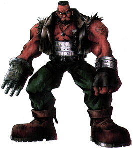

# Introduction

## Controls
Final Fantasy 7 was originally released on the Sony Playstation and has been built around the Sony Playstation controller, this is what we will use as the basis for describing the controls.

 Circle Button

 Square Button

 Cross Button

 Triangle Button

    D-pad. This is the pad that controls direction, the four directions are up, down, left and right.

 SELECT button.

 START button.

  L1 Button.

  L2 Button

  R1 Button.

  R2 Button

### Normal Play

| Button   |      Action   |
|----------|:-------------:|
|    |  Movement |
|  |  Speak / Execute   |
|  | Run |
|  | Menu |
|   | Turn left |
|   | Turn right |
|  | Position cursor on / off |

### Battle

| Button   |      Action   |
|----------|:-------------:|
|   |  Menu navigation |
|  |  Change order |
|  |  Defend |
|  |  Select menu command   |
|  | Cancel selection |
|  | Change active character |
|  | Hide command menu |
|   | Toggle All Mode on / off |
|   | Toggle Targetting Mode on / off |
|  | Information mode |
|   | Pause |

### World Map

| Button   |      Action   |
|----------|:-------------:|
|     |  Movement |

### Buggy

Same controls as World Map, in addition:

| Button   |      Action   |
|----------|:-------------:|
|  |  Get out |

You can drive on dry land and shallow parts of rivers. You can even enter Costa del Sol and Junon by buggy, by hitching a ride on the 'Cargo Ship'. 

### Seaplane

Same controls as World Map, in addition:

| Button   |      Action   |
|----------|:-------------:|
|  |  Get out |

You can only float on light blue water and rivers. You can exit on beaches. 

### Highwind

| Button   |      Action   |
|----------|:-------------:|
|  |  Ascend |
|  |  Descend |
|  /  |  Steer |
|   /  |  Steer hard |
|  |  Enter cockpit |
|  |  Go forwards |
|  |  Fly sideways |
|  |  Land |

You can go anywhere in the air. You can only land on grass, and near the Forgotten City. 

### Submarine

| Button   |      Action   |
|----------|:-------------:|
|  |  Descend |
|  |  Ascend |
|  /  |  Steer |
|  |  Move forward |
|  |  Submerge / dive / get out |

You can only go in dark blue water. You can only get out in bays. 

### Chocobo

Same controls as World Map, in addition:

| Button   |      Action   |
|----------|:-------------:|
|  |  Get off |

Yellow Chocobo’s can only go on land.

Blue Chocobo’s can only go on land and light blue water.

Green Chocobo’s can only go on land and over mountains.

Black Chocobo’s can go anywhere Blue ones and Green ones can.

Gold Chocobo’s can go anywhere Black ones can, and on any water. 

## HP and MP System
For those of you that have not played RPG's, here's a brief explanation of HP and MP:

HP stands for Hit Points. This is basically your character's lifeline, energy, or health. Once your HP goes down to 0, you die. HP is subtracted by attacks (represented by white numbers popping up after a hit takes place), or added by curative magic or items (represented by green numbers). Your character's HP is displayed in the lower right corner of the screen during a fight scene. The maximum number of HP is 9999 for your character, and 999999 for an enemy.

MP stands for Magic Points. This number determines how many spells a character can cast. Each time a magic attack is cast, a monster is summoned, or an Enemy Skill is performed, MP is subtracted from your character's total. The more powerful a magic attack, generally the more MP is taken away. These are displayed in the lower right corner of the screen during a battle. The maximum MP for your character is 999, and 99999 for an enemy. 

## Experience System

More details for you novice RPG-er's. Experience points are added to your character after each battle (with a few exceptions, such as some boss battles, a character dies, team flee’s the battle or the enemy flees the battle.). After a certain amount of experience, your character will go up a level. Going up a level increases that character's stats, being attack power, defence, magic power, speed, and a handful of others. You can check your character's total experience, level, and amount of experience to go to the next level. Just access the menu and select Status, then the desired character. Under the character's name, it says Lax, where ox is the level. To the right, just next to the box that says Status, is the character's total experience. Under the box that says Status is how much experience is needed to get to the next level. 

## Materia and AP System

Materia and ability points are not an entirely new concept to RPG’s; Final Fantasy 5 had these to a degree. Basically, equipping a certain type of Materia on a character allows him to cast certain spells or perform other special actions. You cannot use Materia until just before you assault the No. 5 Reactor.

Weapons and armour have slots on them for Materia (with few exceptions). Just access the Materia sub screen on the menu. This shows the slots. Black slots are empty, and coloured ones have Materia in them. Navigate between the slots with the finger cursor. This displays the Materia's name and stats in the box to the lower left. The magic that each Materia enables is displayed in the box in the lower left, under Ability List. White options are ones that you can use, grey still have to be developed. The effects of equipping that Materia are shown under Equip Effect.

After each battle (for the most part) you win AP. AP stands for Ability Points. As Materia gains AP, more abilities are enabled. For example, if you get a Lightning Materia, it starts out on level 1, and you only can use the spell Bolt. But as you gain AP, and thus gain levels, you get access to the spells Bolt 2 and Bolt 3. The amount of AP needed to get the Materia to gain a level is shown on the Materia screen next to "To next level". The number of levels gained by the Materia is shown by how many stars are lit up. Once all the stars are lit, the Materia is mastered, which means it is at its full functionality. When you master a Materia, it creates a new one of itself, which starts out at no AP. The game tells you after a fight when Materia gains a level or is born.

Each weapon and armour has a different growth rate of Materia. This is displayed on the Equip screen, under Growth. Normal means that the number of AP you get after a battle is added to each Materia in the weapon or armour. Double, Triple, or Quadruple means that the AP is multiplied by two, three, or four times. Nothing means that Materia does not grow in that weapon or armour.

Linked slots are shown on weapons and armour by having a black line between them. This allows paired blue Materia to be used. If Restore is paired with All, you can Cure everyone. But, there has to be a link between the slots. 

## Status Ailments and Benefits

FF7 has a status system, like all of the other Final Fantasies. When a character has a particular status, he acts differently than normal. Status effects of materia can be ascribed to weapons and armour through the use of the Added Effect Materia. If the materia is linked with Added Effect on a weapon, that weapon ascribes that status to the target. If Added Effect is used on armour, the armour protects against that status. Here are the statuses:

* Death: The character falls to the ground, dead. His HP has dropped to 0. The only way he can fight again is to have Revive-type magic used on him, or the item Phoenix Down. The character does not gain experience or AP when he is dead. If all of your party has this status, you lose. This lasts until he is revived.
* Near-Death: The character falls to his knees and his HP is represented in yellow. He is very close to dying. Using Potion or Elixir-type items, or Restore-type magic can rectify this. This lasts until he is cured.
 * Sleep: The character stops and has "Zzzz" coming out of him. His time gauge does not fill. To wake him, he needs to be attacked, either by you or an enemy. This lasts until the fight ends.
* Poison: The character flashes green and loses a certain amount of HP every turn. To cure this, use Heal-type magic, or the item Antidote. This lasts until the fight is over.
* Sadness: The character's Limit Gauge turns blue. He does not hit as hard with physical attacks, and his Limit Gauge only fills half as fast. This is ended with the item Hyper. This status lasts until you use a Hyper.
* Fury: The character's Limit Gauge turns from pink to red. He hits harder, but misses attacks more often. His Limit Gauge fills twice as fast. This is ended with the item Tranquilliser. This status lasts till you Tranquillise him.
    Confusion: The character spins in circles and attacks you and your party members. The character being attacked, either by an enemy or you solves this. When the fight is over, the character returns too normal.
* Silence: The character has a speech bubble with "...." floating over his head. He cannot use magic attacks, Summons, or Enemy Skills. This is cured with Heal-type magic or the item Echo Screen. This lasts until the end of the fight.
* Haste: The character moves twice as fast, and his Time Gauge fills twice as fast. This is ended with the character's death, or use of Slow-type or DeSpell magic. This ends after the battle.
* Slow: The character moves half as fast, and his Time Gauge fills half as fast. This is ended with the character's death, or use of Haste-type or DeSpell magic. This ends after the battle.
* Stop: The character stops moving. His Time Gauge does not move. The only way to cure this is to use DeSpell magic, wait until it wears off, or finish the current fight. This only lasts until the end of the battle.
* Frog: The character turns into a frog. During this, he can use no magic besides Frog, and his attacks are greatly reduced. Using Frog-type magic, DeSpell, Heal-type magic, or the item Maiden’s Kiss, cures this. This ends after the fight.
* Small: The character shrinks down to a quarter of his normal size. He can still use all magic and attacks, but they only do 1 HP damage. This is cured by Mini-type magic, Heal-type magic, DeSpell, or the item Cornucopia. This lasts until the end of the battle.
* Slow numb: The character flashes grey and has a time over his head. When the time expires, he turns into status Petrify. Slow numb is cured by Heal-type magic, or the item Soft. This lasts until the end of the battle, or until the timer runs out, whichever comes first.
* Petrify: The character is grey. His time gauge does not fill and he does not move. If all characters are petrified, you lose. This is cured with the item Soft, or with Heal-type magic. This lasts until the fight is over.
* Regen: The character flashes orange. His HP slowly comes back up if it is not at its maximum. This ends at random, usually more than eight turns. Once the battle ends, so does Regen.
* Barrier: Each time someone uses a physical attack on the character, a white pyramid appears in front of him and he takes half the normal damage. This can be ended by DeBarrier-type magic. This lasts until the Orange (top) Barrier Gauge goes to nothing, or until the fight is over.
* MBarrier: Each time someone uses a magic attack on the character, a coloured dome appears in front of him and he takes half the normal damage. This can be ended by DeBarrier-type magic. This lasts until the Red (bottom) Barrier Gauge goes to nothing, or until the fight is over.
* Reflect: If a magic attack is used on a character, three green domes appear in front of him and the magic is reflected upon the opposing party. This is ended by DeSpell magic. This lasts a random amount of turns, usually around eight, or it ends when the fight does.
* Shield: The character is invincible to most attacks for a short time. This ends in a few turns, or when the fight does, whichever comes first.
 * Death-sentence: The character has a timer over his head. When the timer expires, the character's status changes to Death. This ends with the timer running out, or the fight ending, whichever comes first.
* Manipulate: The character flashes green, and is controlled by a member of the opposing party. An attack, Sleep status, or the character dying cures this. This ends at the end of a fight.
 * Berserk: The character flashes red and you lose control of him. He only performs physical attacks, but both his speed and attack power are increased. This is cured by Heal-type magic. It ends with the fight.
* Peerless: The character flashes yellow. Like Shield status, but the character is completely invincible. There are no attacks that can break through the Peerless status. Ends in a few rounds, or with the end of the fight, whichever comes first.
* Paralysed: Like Stop status, but is cured with Heal-type magic. This ends when the fight does.
* Darkness: The character flashes black, and cannot see. His hit accuracy rate is severely reduced. This is cured by Heal-type magic, or the item Eye drop. This ends with the fight.

## Elements

Elementals are the various types of magic in Final Fantasy 7. The elemental of a particular materia is listed on the Materia screen. Elementals of materia can be ascribed to weapons and armour through the use of the Elemental Materia. If the materia is linked with Elemental on a weapon, that weapon adds damage according to the element. If Elemental is used on armour, the armour protects against that element. There are 8 basic elementals:

* Fire - Works best on animals and water monsters.
* Ice - Works best on fire monsters and things that hate the cold.
* Lightning - Works best on mechanical things.
*    Earth - Attacks using the earth's power. Doesn't work on flying enemies.
 *   Poison - Poisons enemies. Doesn't work on any poison based enemies.
  *  Gravity - Gravity based attack. These hurt if they hit.
   * Water =- Calls on the earth's water. Works well on fire monsters.
* Wind -   Calls up the winds. Works well on flying enemies.
* Holy -   Calls up the Planet's power. Works well on dark/evil monsters. 

## Battles

### Battle Screen

Battles are the main action in this game. Follow this link for the controls for the Battle Screen. The screen displays your HP and MP in the lower right, and the current state of your physical and magic barriers in the lower left. When your character's Time Gauge (above HP/MP) fills, he can take his turn in battle.

The options you can use in battle are Attack (this can be replaced by 2x Cut, 4x Cut, Slash-All, or Flash), Magic (can be replaced by W-Magic), the commands (enabled by Command Materia), the Summons (enabled by Summon Materia, can be replaced by W-Summon), and Item (can be replaced by W-Item).

Attack lets you do a physical attack on an enemy. Magic or W-Magic lets you use magic on yourself or the enemies. Commands such as Steal, Throw, and Mime only appear if you have their Command Materia equipped. Summons such as Shiva, Ifrit, and Ramuh only appear if you have their Summon Materia equipped. Item or W-Item lets you use items, whether they are curative or attack items. 

## Locations

### Continents

*    Northern Continent: The large continent at the top of the Map. Looks like a Chocobo.
*   Eastern Continent: The continent that you start the game on.
*  Central Continent: The continent to the west of the Eastern Continent. Have Nibelheim and the Gold Saucer.
* Western Continent: The long, thin continent to the left side of the Map. Has Wutai on it.
* Southern Continent: The long, thin continent near the bottom of the Map. Has Mideel on it.
    
### Cities
 
* Midgar: The city where you first enter the World Map. Large, eight-sectioned city with smog around it. Northwest corner of the Eastern Continent.
*Kalm: The city just to the east of Midgar. Represented by two houses, one with a green roof, and one with a blue roof. North side of the Eastern Continent.
*    Junon: South and a little west of Midgar. Western coast of the Eastern Continent. Built into a cliff, so it's hard to see. For a majority of the game, it has a large cannon (the Sister Ray) jutting out of it
*    Costa Del Sol: Northeast coast of the Central Continent. Looks like two houses with pink roofs, and two docks. Almost directly west of Midgar.
*    Corel: Northern side of the Central Continent. Looks like two old cabin tents. Straight west of Costa del Sol.
*    Gongaga: Southeast corner of the Central Continent. Looks like a blown up can. Almost straight south from Corel.
*    Cosmo Canyon: Southwest corner of the Central Continent; the sky is red here. Looks like two green huts and an observatory built into a cliff. Almost straight west of Gongaga.
*    Nibelheim: Western side of the Central Continent. Surrounded by pointy grey mountains. Looks like two houses with pink roofs. Southwest of Corel.
*    Rocket Town: Northwest corner of the Central Continent. Looks like two houses and a rocket propped up by a stand. Northwest of Nibelheim.
*    Wutai: The only city on the Western Continent, it's near the northern tip. Looks like two red Japanese houses. Northwest of Rocket Town.
*    Bone Village: Southern tip of the Northern Continent. One of the few places on the Northern Continent without snow. Looks like a dinosaur's rib cage and skull. Northwest of Midgar.
*    Forgotten City: Southern part of the Northern Continent. Looks like a giant tree in a crack in the ground. Just northeast of Bone Village.
 *   Icicle Inn: Centre of the Northern Continent. Looks like two beige houses. Northwest of Bone Village.
  *  Mideel: The only city on the Southern Continent. Looks like two houses before Ultimate Weapon attacks, looks like a green pool afterwards. Due south of Kalm

### Islands

 *   Woodlands Area: Island southwest of Fort Condor. On the large World Map, has a V-shaped mountain at the northeast corner.
 *   Goblin Island: Actually should be Goblin Islands. The group of islands at the northeast corner of the World Map. Northeast of Kalm.
 *   Cactus Island: Uncharted island in the far south and not so far west part of the Map. Looks like a small island. South and slightly west of Cosmo Canyon.
 *   Round Island: Uncharted Island at the extreme northeast corner of the Map. Looks like a small, round island, with a ring of mountains around it.
    
### Other Places of Interest

 *   Chocobo Farm: Southeast of Kalm. Eastern side of the Eastern Continent. Looks like a house with a pink roof, a barn, and a silo.
 *   Fort Condor: Southern portion of the Eastern Continent. Looks like a blue cylinder with a bird perched atop it before you win the battle, minus the bird afterwards.
 *   Gold Saucer: Eastern side of the Central Continent. Looks like a giant gold tree. Almost due south of Corel, it's surrounded by desert.
 *   Weapon Seller's: Single house in the southeast corner of the Central Continent. Straight south of the Gold Saucer.
 *   The Northern Continent. Looks like a house with a green roof. East and slightly north of Icicle Inn.
 *   Northern Crater: Top point of the Northern Continent. The Chocobo’s eye. Looks like a large hole in the ground, duh! Due north from Icicle Inn.
 *   Sleeping Man's Cave: North-central part of the Eastern continent. Looks like a cave! Southeast of Midgar.
 *   Temple of the Ancients: On the Woodlands Area Island just off the southwest coast of the Eastern Continent. Looks like a pyramid before it gets turned into the Black Materia, afterwards it's just another hole in the ground.
 *   Mythril Mine: South-central part of the Eastern Continent. It's a cave at the south side of the swamp. Southwest of the Chocobo Farm.
 *   Mt. Corel: Northern part of the Central Continent. Looks like a cave at the end of mountain road. Ever so slightly northeast of Corel.
 *   Mt. Nibel: Northern part of the Central Continent. Looks like a cave in the side of a pointy mountain. Just west of Nibelheim.
 *   Corral Valley Cave: Eastern-Central part of the Northern Continent. Looks like a cave. North and a little west of the Forgotten City.
 *   Vincent's Waterfall: North-central part of the Central Continent. Looks like a waterfall at the top of a large lake. Just southeast of Nibelheim.
 *   Westernmost Cave: Eastern-central part of the Western Continent. It's a cave in the side of a small mountain. Straight west from Rocket Town.
 *   Western Cave: Northern part of the Central Continent. Looks like a cave. North of Corel.
 *   Southernmost Cave: Northern tip of the island chain off of the Southern Continent. It looks like a cave in a small mountain with a long strip of land leading up to it.
 *   Northernmost Cave: Round Island. Northeast of, well, everything. Almost as far north and east as you can go. It's the only thing on Round Island.
    
### World Map

## PHS

The PHS stands for the Party Hensei System. It is like a mobile phone that you can use to call your friends. You can call them from the World Map or from most save points, to change party members. It is also used at various points in the game for communication. 

# General

## Gameplay Tips

To reset the game, during Normal Play or on the World Map, hit , , ,  , , and  at the same time.

Always have at least 5 Tents on you at any time. You never know when you may need one.

Cover Materia is good to equip on someone whom you are trying to teach his or her Limit Breaks. Also use the item Hyper.

Elixirs and Megalixir are very valuable. Megalixir are like Tents that you can use anywhere.

Good places to build experience are the Northern Crater, the Sunken Plane, and near Mideel.

The best place to accumulate AP is in the Northern Crater. Take the upper left path and fight the Magic Pots. Give them each an Elixir for 1000 AP. This is not a problem if you use the W-Item cheat (see Top-Secret Unlimited Item Cheat).

Move Barret to the back row if he has a long-range weapon. Alternately, give someone the Long Range Materia and move him or her to the back row. They only take half of the physical damage from back here, yet still inflict normal damage.

Always keep cursor mode (SELECT BUTTON) on during play and fights. It helps!

Use the W-Item cheat to get 99 Ethers, and then sell 98 of them at 750 gil per, that's 73500 gil! Or better yet, buy one Sylkis Green from the Chocobo Sage, turn it into 99, then hock 98 of them off at 2500 gil apiece! 245000 gil for a couple of minute’s worth of work!

## Materia Tips
*    Cover and Counter Attack - When anyone is attacked, attack back!
*    Quadra Magic/Bahamut ZERO and W-Magic - Attack 8 times with Bahamut ZERO!
*    Ultima and Counter (not Counter Attack) - When hit, you counter with Ultima.
*    MP Turbo and Knights of the Round - About 90000 HP (if you haven't brought Knights of the Round up a level)!
*    W-Summon and Knights of the Round - Over 130000 HP (only works if you have brought Knights of the Round up a level)! Two times!
*    Final Attack and Revive - Die, then use Life!
*    Mega All and Steal - Steal from everyone.
*    Hades/Added Effect in your weapon - Attack with a chance of using Slow, Stop, Sleep, Confuse, Poison, Silence, and Mini.
* Mastered Contain/Added Effect in your weapon - Attack with a chance of using Stop, Petrify, or Confuse.
*  Mastered Cover and as many mastered Counter Attacks as you can find. Upon any member of your party being struck for physical damage, the person with these materia will hit back as many times as you have Counter Attack materia.
*  Quadra Magic/Ultima and Quadra Magic/Ultima and Quadra Magic/Ultima and W-Magic -  Attack up to 15 times with Ultima.

# Characters

## Cloud Strife

Occupation: Mercenary

Age: 21

Weapon: Buster Sword

Height: 173 cm

Birth date: August 19

Birthplace: Nibelheim

Cloud is the primary character in Final Fantasy 7. Originally, he was a member of SOLDIER (an elite group of warriors) but is now a mercenary who will take any job. After being hired by AVALANCHE (A guerrilla group of eco-warriors) he gradually is caught in a massive struggle for the very life of the planet. His weapon, the Buster Sword, is a mighty weapon that can cut almost anything or anyone in two.

The main character of Final Fantasy VII, Cloud grew up with Tifa in Nibelheim. He aspired to become a member of the elite Shinra group of SOLDIER and be just like Sephiroth. He failed in his mission and met Zack. Him and Zack were with each other for a while, going through many hardships until they got to Midgar. He then joined a group called Avalanche who rebelled against Shinra. His rival is Sephiroth and his main goal is to destroy him. He holds a giant blade at all times and is strong enough to be able to swiftly move the blade

##  Aeris Gainsborough

Occupation: Flower Merchant

Age: 22

Weapon: Staff

Height: 163 cm

Birth date: February 7

Birthplace: Unknown

Aeris was born secretly in the Icicle Village and was soon taken by Shinra to Midgar. Her and her mother escaped to the Sector 5 slums. There, Aeris lives with Elmyra in her house. The Turks kept trying to capture her as she was the last of the Cetra race and valuable to Shinra, but she kept eluding them. She is the best magic user in the game.

## Tifa Lockheart

Occupation: Bar Hostess

Age: 20

Weapon: Gloves (Martial Arts)

Height: 167 cm

Birth date: May 3

Birthplace: Nibelheim

Bright and optimistic, Tifa always cheers up others when they're feeling down. Don't let her looks fool you, for Tifa is an accomplished martial artist, being trained from a young age. One of the main members of AVALANCHE, she and Cloud were childhood friends. Although she harbours strong feelings for him, she would never admit it openly.

Tifa grew up with Cloud, they were close at times, but a lot of other boys were around her most of the time so they could never really get together. After Cloud left, Tifa became really sad and eventually left Nibelheim to go the Midgar. There she joined the group Avalanche and started up a bar called 7th Heaven in Sector 7.

## Barret Wallace

Occupation: Leader of AVALANCHE

Age: 35

Weapon: Biomechanical Machine Gun

Height: 197 cm

Birth date: December 15

Birthplace: Corel Village

Head of the underground resistance movement AVALANCHE, Barrett is fighting the global conglomerate Shinra. Inc. Barrett depends on brute strength and his gun arm to see him through. With his wife dead, a result of a Shinra machinations, Barrett is a somewhat harsh man, who lives with his daughter Marlene.

Barret was born and raised in the mining village of Corel. When Shinra wanted to build a reactor there, the people refused but had to accept. When Shinra believed that the people were abusing the reactor, they set out for destruction. Barret lost his right arm in a skirmish with Shinra troops and after that, he had a gun put on the arm for his revenge on Shinra and started a group called Avalanche which was hell bent on destroying Shinra.

## Red XIII

Occupation: Beast

Age: 45

Weapon: Head Dress

Height: 120 cm

Birth date: Unknown

Birthplace: Cosmo Canyon

Just as his name implies, he is an animal with fire-red fur. But under his fierce exterior is an intelligence surpassing that of any human. His sharp claws and fangs make him good at close range fighting. Other than that, however, not much else is known about him. It's not even certain that Red XIII is his real name.

Actually a teenager still in his years, Red XIII grew up protecting Cosmo Canyon and believing his father was a traitor. He got captured by Shinra and became a research specimen. He was eventually saved by Cloud and the group and also found the truth about his father. His grandfather, Bugenhagen, is human, which makes no sense but who's to argue.

## Cait Sith

Occupation: Toysaurus

Age: Unknown

Weapon: Megaphone

Height: 100 cm

Birth date: Unknown

Birthplace: Unknown

 

Cait Sith rides around on the back of a huge stuffed Mog he magically brought to life. Megaphone in hand, he's always shouting orders and creating dopey attacks. When his slot machine attack works, though, the enemy lines look like an overturned toy box. His hobby is fortune telling, but like his personality, it's pretty unreliable.

 

Cait Sith was a fortune-teller in Gold Saucer when it met Cloud and the group. Reeve, Shinra's Head of Urban Development, created it to spy of Cloud and the group. It eventually earned its keep and became a permanent member of the group, though quite useless.

## Cid Highwind

Occupation: Pilot

Age: 32

Weapon: Spear

Height: 178 cm

Birth date: February 22

Birthplace: Unknown

Cid is a tough-talking, warm-hearted old pilot who hasn't forgotten his dreams. There's no better pilot by air, or sea, believing that someday he'll fly to the ends of the universe. With his handmade spear and knowledge of machinery, he throws himself into any attack regardless of the danger.

Cid was going to be the first man in space on Shinra's No. 26 rocket. When Shera screwed up his rocket plan, she decided to let Cid live with her in Rocket Town. Cid is a tense man who swears a lot. He is the creator of such airships as the Highwind and Tiny Bronco.

## Vincent Valentine

Occupation: Unemployed

Age: 27

Weapon: Gun

Height: 184 cm

Birth date: October 13

Birthplace: unknown.

A mystical man, stern and upright while at the same time, dark and mysterious. His past connection with Shinra Inc. is what made him join Cloud and the others. He may seem frail at first glance but inside his body lurks a fearsome power.

Very mysterious, the second secret character you find sleeps in Nibelheim. A former Turk, Vincent was in love with Lucrecia, until an accident occurred which resulted in Vincent sentencing himself to a life of sleep. Not much is known about his past, but he does swear revenge on Sephiroth and Shinra.

## Yuffie Kisargi

Occupation: Materia Hunter, Ninja

Age: 16

Weapon: Knife, Boomerang, and Origami

Height: 160 cm

Birth date: November 20

Birthplace: Wutai

Although you'd never know it if you looked at her, Yuffie comes from a long line of Ninja. She forced herself into the group just to get a certain something. She's sneaky, arrogant and "way" selfish. But, with her super shuriken and her special skills, there isn't anyone else you'd rather have on your side in a fight.

Yuffie is usually the first secret character you encounter. Found in most forests, you can encounter her even before going to Junon for the first time. She was raised in Wutai, where she became a mischievous thief and left Wutai to try and find materia strong enough to save Wutai from the tourism that Shinra had brought. It gets very interesting when she first returns home with Cloud and the group.

## Sephiroth

Occupation: Top Ranking SOLDIER Officer

Age: Unknown

Weapon: Long Sword

Height: 185 cm

Birth date: Unknown

Birthplace: Unknown

Even amongst the elite troops of SOLDIER, Sephiroth is known to be the best. His past is locked away in a confidential file held by Shinra Inc. His giant sword, which only he can handle, has extremely destructive power. Said to have disappeared in a battle years ago, his current whereabouts are unknown.
