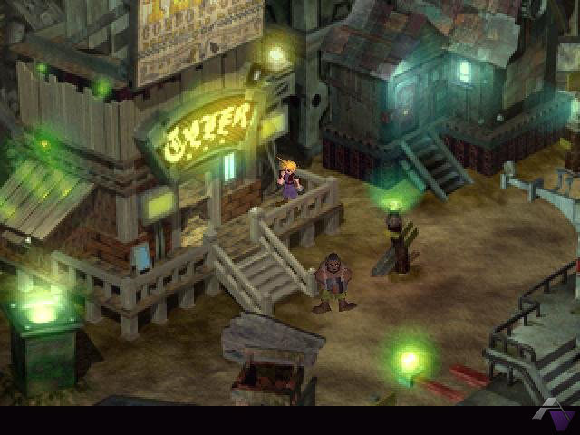
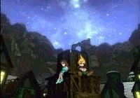
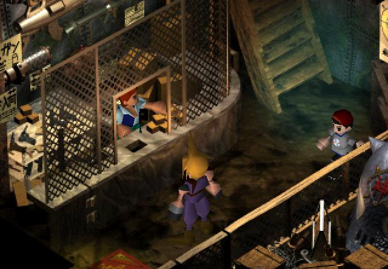
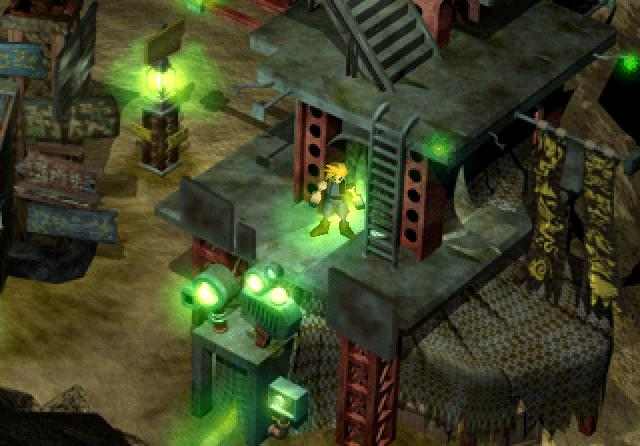
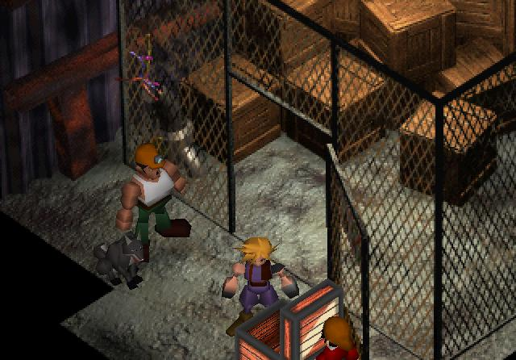
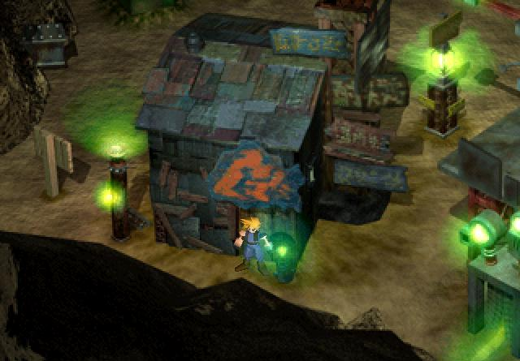
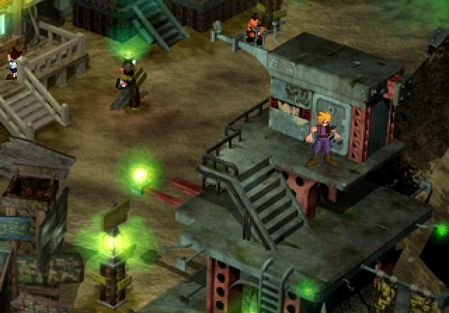
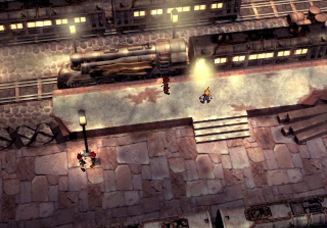

#  Sector 7 Slums

## Story So Far

The AVALANCHE team have managaged to escape from Sector 7 Town where they blew up the Sector 7 reactor, despite security checks on the train, fake IDs have allowed them to pass through undetected thanks to Jessie's excellent work. The train arrives at the Sector 7 Slum train station and team get ready to head back to base.

## About this area

In this section write a bit of narration providing some background of the area.

## Enemies encountered here

- Enemy A
- Enemy B
- Enemy C

## Items available here

You can find the following item(s) here:

- Potion
- All materia
- Ether

## Guide
Follow the team off to the left of the screen. In the next screen, head north, there is a guy excitedly looking at the pillar, chat with him to see it. There is also a save point here. Now would be a good time to save your game. Once saved, head off the left side of the screen.

Now go down and left to AVALANCHE H.Q., a.k.a. Tifa's 7th Heaven bar. Enter the bar, and talk to Tifa, and the little girl, Marlene. After naming Tifa, give Tifa a flower.

> 
> New Character: Tifa
> Tifa Lockheart, Cloud and Tifa knew each other as children from when they lived together in Nibelheim. Now Tifa runs a bar in the Sector 7 Slums called 7th Heaven.
>

Now talk to everyone else. Try to leave the bar, and Barret will come barging in. Once he’s finished and summoned the meeting, go talk with Tifa at the bar and have a drink. Once you have finished with Tifa, follow Barret downstairs and talk to all the members. 

Go back upstairs and try to leave. Tifa follows you, so talk to her and watch the childhood story. Barret comes and pays you 1500 gil for the mission. 

After you agree (?) to go on the next mission, you go to sleep. Wake up and go upstairs. Marlene is at the bar mixing drinks. Talk to Tifa and Barret. You explain to Barret how to use materia, from this point on, you can equip and use materia to boost your attributes and use additional skills to help defeat your enemies. 

Tifa and Barret will join you so leave the bar and run to the large building to the bottom right. 

Buy three Iron Bangles from the man behind the counter. Equip them and sell the Bronze Bangles for a bit of extra cash. 

Go up to the second floor to the Beginner's Hall 

and talk to everyone. The dog explains how to use the buttons. Grab the blue circle by the boy on the right's feet. It's an All Materia. He then gives you an Ether. 

The kids beating each other up explain Limit Gauges. The lady in pink explains about Save Points. The three big guys on the right and the big construction worker by the entrance explain pretty much everything else. Leave this building.

Now go down to the shack near the bottom left of the screen. 

Don't buy any Potions here, you should have enough already. Do, however, buy one Restore Materia (now you will have two Restore – it will make surviving in boss battles much easier) and two Fire Materia, one Lightning and one Ice. Equip them. If you need more gil, equip any materia that you have already purchased (you will need a total of 3,150 gil to purchase all of this), run back near the train station, and continue right. Fight the Sweepers, Guard Hounds, and Mono Drives here until you have enough. 

If you need to, the third floor contains an Inn where you can rest up to restore your stats.

Now you should have two of every materia. You should find that you can’t equip one materia because you don’t have the space in your equipment, don’t worry, just wait until you get some new equipment, then you can equip it.

When you’re ready, head to the train station.

## Navigation
[Previous chapter - Sector 7 Town](/chapter-02-sector-7-town.md) / [Next chapter - Train to Sector 5](/chapter-04-sector-5-reactor.md)
