#  Chapter 05 - Sector 5 Slums

## Story So Far

In this section write a bit of a narration about what has happened.

## About this area

In this section write a bit of narration providing some background of the area.

## Enemies encountered here

- Enemy A
- Enemy B
- Enemy C

## Items available here

You can find the following item(s) here:

- 5 gil
- Cover Materia
- Ether
- Potion
- Phoenix Down 

## Guide

Write a guide on what is happening and what to do.

>
> New Character: New character name. 
> In this section we should write a bit about the new person we just met, also include a picture.
>

When you wake up, you meet Aeris, whose flower bed you fell on. When you talk to her, pick the top option, then the top option, and the top option. Actually, if you leave the church and walk outside the doors to the right, you can talk to Reno briefly... Walk to Aeris and talk to her again. Name her, and then talk some more. Reno of the Turks comes in to the church. Talk to Aeris again, and then fight the guards.

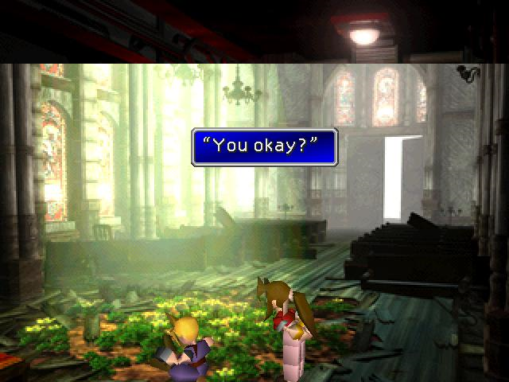 

Run to the back. You can just across to the stairs by walking on the bit of platform sticking out next to the rocket that has fallen in. Once the Shinra Guards start coming after Aeris, you can either fight the guards with Aeris or have Cloud drop barrels on them. I prefer to fight to get that little bit extra experience. But if you don't want to fight, drop the barrels in this order: the barrel on the far left, the barrel in the back, and the barrel on the right. Climb up out onto the roof using the broken plank.

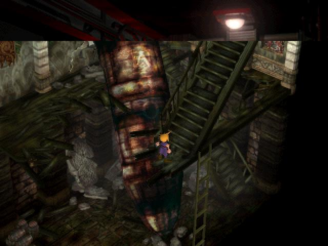 

Talk with Aeris, and then walk along the rooftops. You end up in the slums. 

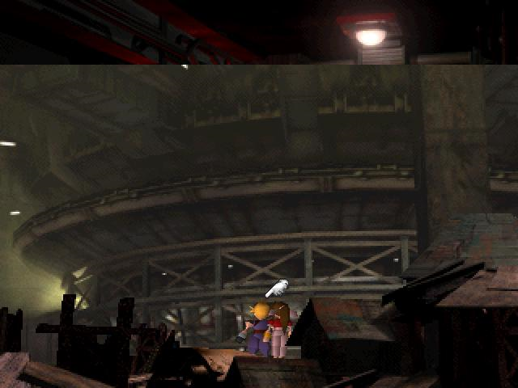 

Save and go left one screen. Now go up where the light is, this takes you to the town. 

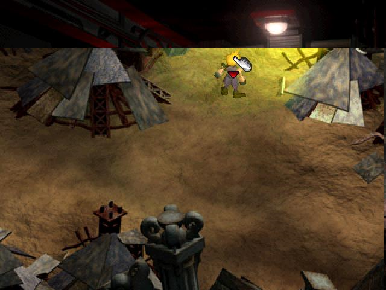 

Enter the pipe on the left just as you go in. The guy in the pipe only says "Uhhh”, also has a tattoo of a number. Remember this guy... you'll meet more of his type later on....

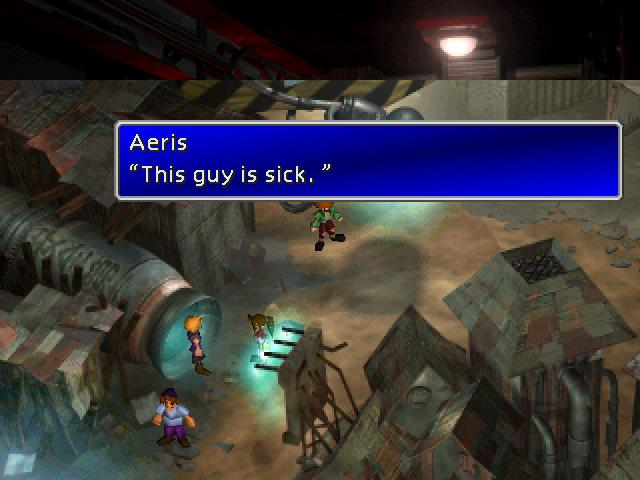 

Buy some armour from the building in the top right, you will only want to buy one more Titan Bangle to equip to Aeris. You will be able to buy even better armour soon.

 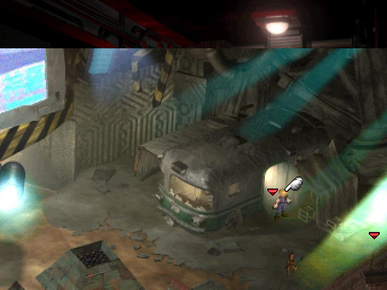 

In the house on the right, you can steal 5 gil from the kid's dresser drawer. If you don't, however, when you return later he gives you Turbo Ether. Also, read the papers on his wall, one of them is the 1st Turtle's Paradise Flyer.
 
 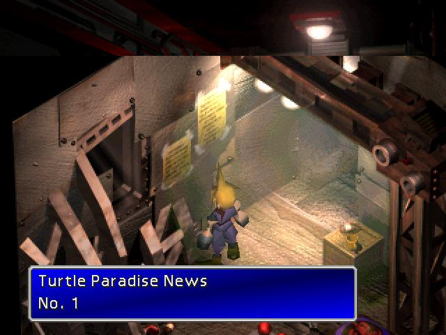 

Go into the light to the right of the weapon shop to go to Aeris's house. Save. Go to the flower garden to the right of the house, and pick up a Cover Materia and an Ether. 

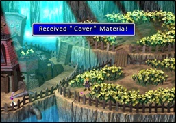 

Enter the house, and talk to Aeris's mum, Elmyra. Then talks to Aeris, and when you have the option, choose the top one. When Aeris goes upstairs, talk to her mum. Go upstairs, and Aeris talks to you again. Sleep, then Cloud has a dream about being home.

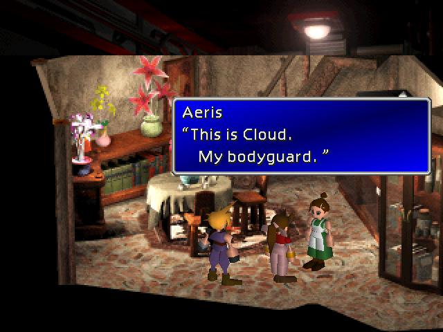 

When you wake up, search by the table at the foot of the bed, you get a Potion and a Phoenix Down. Leave Aeris's, making sure to walk (not run) along the railing, and exit to the town. Go back to the main street, and go north. Aeris is waiting for you here.
 
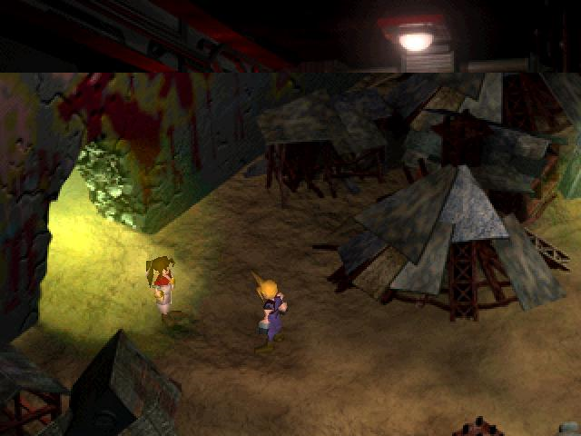 

When you move into the next area, I suggest that you train Aeris and Cloud here until they both have their second limits. This will take a while. When you fight a configuration of 3 ‘worms’ let them attack the party. Use Aeris’s healing wind to keep the party alive, and use Cloud’s limit to kill each enemy. You will find this combination is great for getting your limits up. Especially if you make sure you get attacked from your back – the damage is much greater and allows your Limit Break gauge to fill even faster!

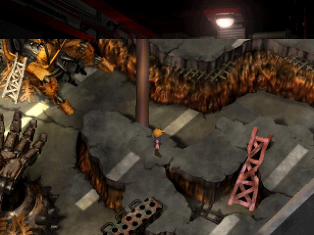 

Train here until both Cloud and Aeris have their second limit breaks. By doing this you are bringing Aeris up to the same levels as the rest of the team.

When you are ready head off the top of the screen.

COTNINUE THE GUIDE

## Navigation
[Previous chapter - TBD](/chapter-04-sector-5-reactor.md) / [Next chapter - Wall Market](/chapter-06-wall-market.md)
