#  Chapter 6 - Wall Market

## Story So Far

In this section write a bit of a narration about what has happened.

## About this area

In this section write a bit of narration providing some background of the area.

## Enemies encountered here

- Enemy A
- Enemy B
- Enemy C

## Items available here

You can find the following item(s) here:

- Ether
- Phoenix Down or Hyper

## Guide

Talk to Aeris, and pick the bottom option. Follow her until she stops and then talk again. After Tifa rides past, follow her to the Wall Market.
 
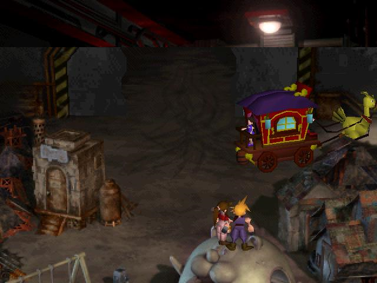 
 
Once you have entered the Wall Market, head off the screen to the right. Talk to the chubby guy in the vest that's talking to the bouncer. Ask him about Tifa.

  
 
Now go back left and all the way north three screens until you reach a mansion. Talk to the guard here, and Aeris will suggest that you should dress like a girl to get in. Yikes! For some reason, you go along with the idea (I would rather fight my way in.). 

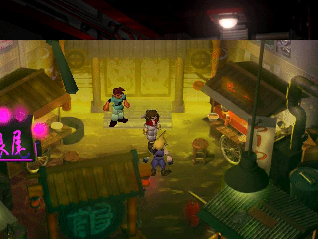 

Now go back to the first screen and talk to the guy in the white shirt on the right side of the screen. He will give you his Member Card to the club.
 
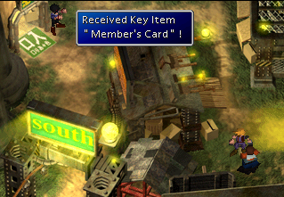 

Enter the room to your upper-left, when you recover, pick the top option. Quickly run to the Bumble Bee to get the Key Item Lingerie.

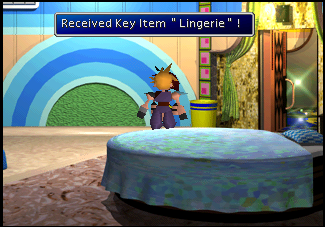 
 
 You can also peek in the rooms on the right. Go into the top room to have makeup put on you.
 
 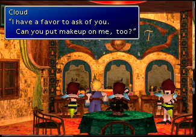 
 
Now go to the clothing store and talk to the girl behind the counter. She explains that her father is "plastered at the bar".
 
 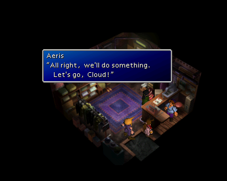 
 
Go up a screen to the bar, (the building with the mat outside that says "IN") and talk to the man sitting on the right side by himself. He will ask you two questions, answer him with the last option for both questions and return to the clothing store. He will give you a dress, based on your answers to his two questions. 

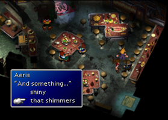 

Go to the artefact shop on the first screen. Talk to the man, and then go sleep at the Inn. In the middle of the night, you wake up. Buy an item, and return it to the man. If you get the 200-gil item, you get the Diamond Tiara, if you pick the 100-gil item, you get the Ruby Tiara, and if you pick the 50-gil item, you get the Glass Tiara. Pick the 200-gil item.

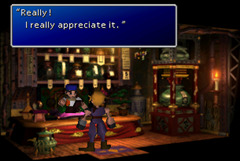 

Go to the sushi bar and sit down. Make sure you have more than 70 gil, and eat one thing you want. When the guy asks you how you like it, tell him the middle option. He will give you an Item Coupon. 

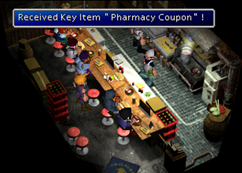 

Take the Item Coupon to the store and exchange it. You can get: Disinfectant, Deodorant, or Digestive. Choose Digestive.  Go to the bar and talk to the person standing outside the bathroom. He's really got to go. Go to the bathroom door and talk to the person inside, and give them the item you got at the store. In return, they will give you an item: Cologne for the Disinfectant, Flower Cologne for the Deodorant and Sexy Cologne for the Digestive. 

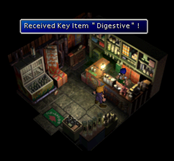 

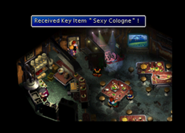 

Also, note that the picture on the wall in the bar slowly changes - the Wutai Pagoda, the Forgotten City tree, a mountain, a field, and a beach.

Go to the gym (second screen, bottom left building, south of the weapon shop). Talk with the "Woman" by the ring. Select the bottom choice, then the bottom choice, and start the squat contest. Press , , in that order, over and over again. If you do more squats than the other guy, you get the Blonde Wig. If you tie, you get the Dyed Wig, and if you lose, you just get the plain old Wig.

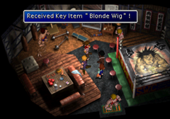 

After getting a Wig, return to the clothing store and try on your nice new dress. Go to the mansion and go on in. 

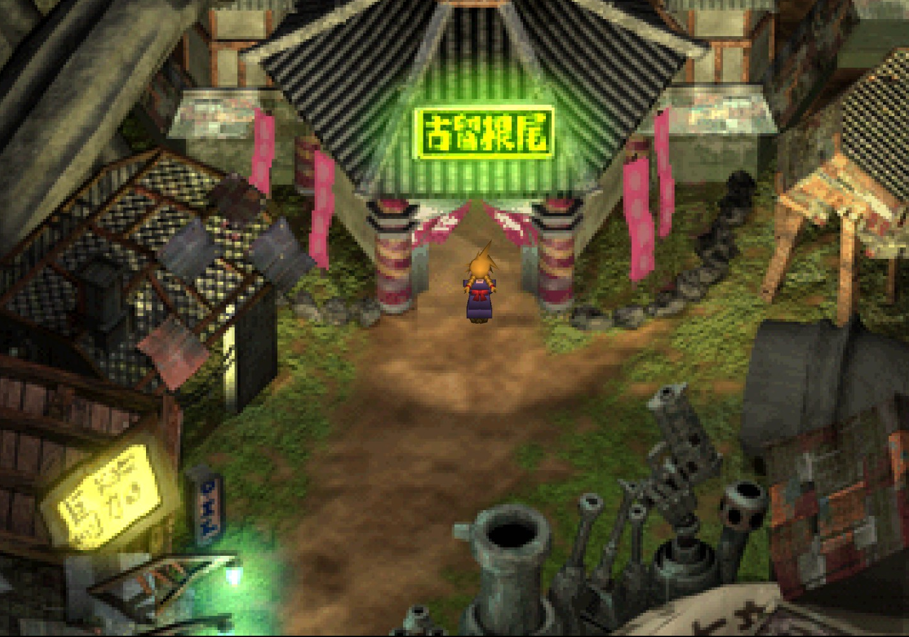 

While the receptionist is away telling Don that you’ve arrived, you need to quickly find Tifa. Ascend the stairs to the right and enter the room on the left. Descend the stairs to find Tifa. Aeris and Tifa have an uncomfortable moment. Get the Ether by the fire. 

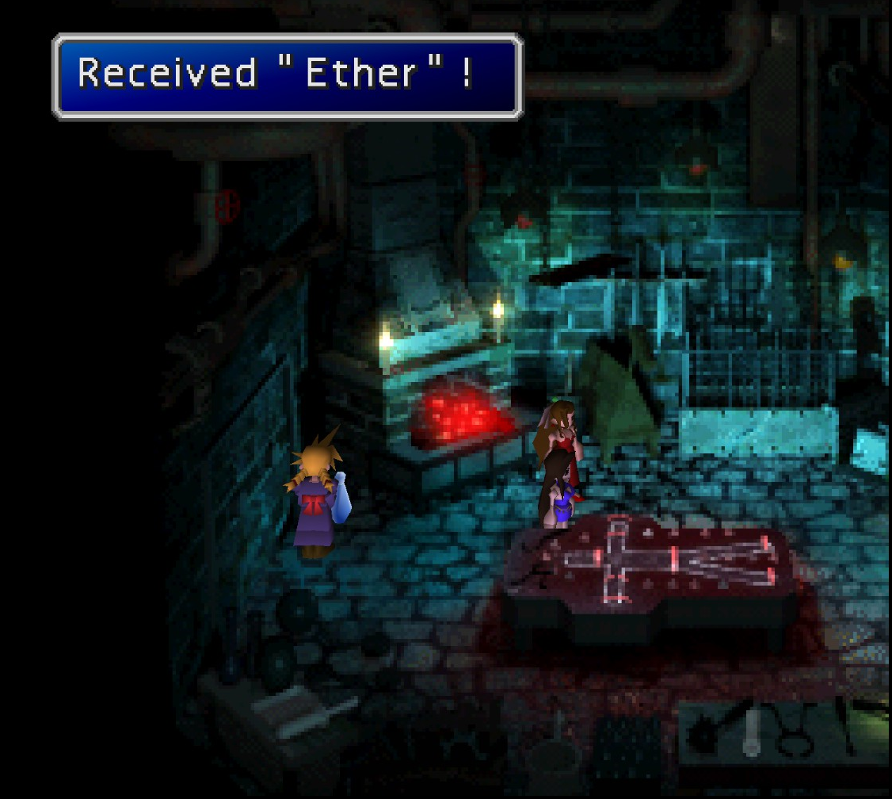 

Now that the team is assembled first things first is to upgrade the equipment on Tifa - you will be able to equip her with the Metal Knuckle and a Mythril Bracelet, then you can equip her with some materia - you should have a Fire and a Restore going spare.

Head upstairs and in the middle door. It is now time for Don Corneo to pick his bride. Who he chooses is based on how well you did in the challenges to dress Cloud up convincingly as a girl.

If Cloud was NOT picked,
you'll end up in a room with a bunch of guys. Get the Phoenix Down in the lower right, and then fight the guys. Save Aeris or Tifa from the Torture Chamber, and bust in the middle door. Next, you talk to him, rather, threaten to rip his gonads off. After this, search behind the bed for a hyper and go stand by the ladies. Don Corneo talks again, pick any one of the three options to fall into the sewer.

If Cloud was picked
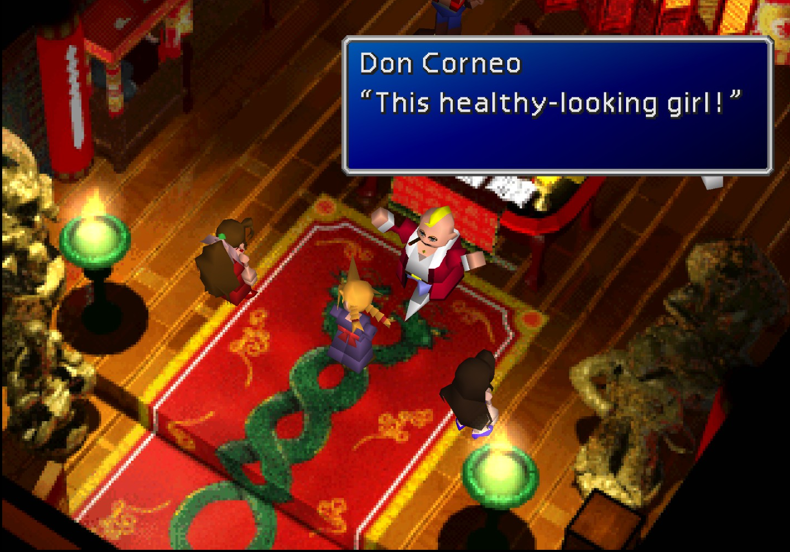 

Search behind the bed for a Hyper. Talk to Don. The girls bust in, and make threats. Talk to him, and pick any of the three options, and into the sewers you go.

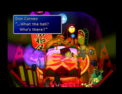 

>
> New Character: New character name. 
> In this section we should write a bit about the new person we just met, also include a picture.
>

## Navigation
[Previous chapter - TBD](/chapter-05-sector-5-slums.md) / [Next chapter - Sewer](/chapter-07-sewer.md)
