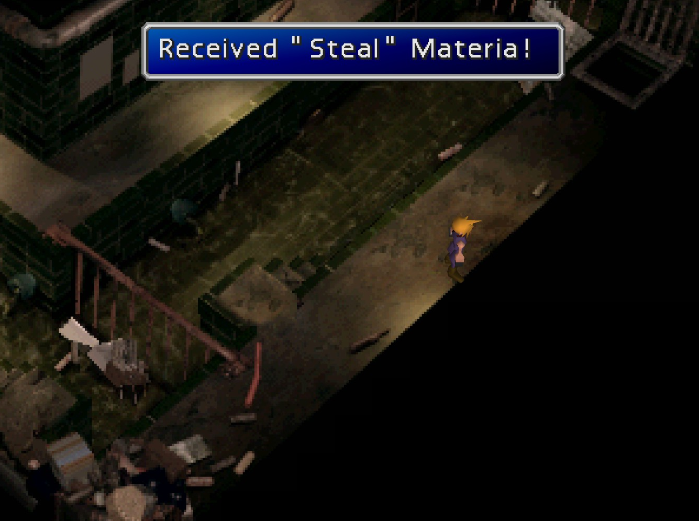

#  Chapter 7 - Sewers

## Story So Far

In this section write a bit of a narration about what has happened.

## About this area

In this section write a bit of narration providing some background of the area.

## Enemies encountered here

- Enemy A
- Enemy B
- Enemy C

## Items available here

You can find the following item(s) here:

- Potion
- Steal materia

## Guide

Watch the action scene at Shinra Headquarters. After this, you wake up in the sewers. Before waking the girls, head south to the stairs, and up to the left for a Potion the make sure everyone in your party has been equipped with materia. 

The reason for this is that there is another boss. Also, have someone equip the Restore/All combination to cure everyone.

 

|   |   |
|---|---|
| Name  | Aps  |
| HP  | 1800  |
| MP  | ??  |
| Level  | 18  |
| Strengths  | None  |
| Weaknesses  | Fire  |

Fire works very well on this boss. His Tsunami attack hurts him as well; in fact, it hurts him more than your party. Keep hitting this boss with fire attacks and after two rounds he will call on his tsunami from behind him causing him more damage than usual. Lightning is also quite effective. If you have got the Cure-All combination setup then only use it when all of your characters are low as you can only use it once without having to use it once per character per round. 

| Rewards  |   |   |   |
|---|---|---|---|
| EXP  | AP  | Gil  | Item(s)  |
| 240  | 22  | 253  | Phoenix Down  |

 

After the battle, climb the ladder, go right, and climb down. Use the stairs and get the Steal Materia. Get this equipped straight away to Tifa to start levelling it up.

 

Jump down the hole in the upper right corner. Run right to the stairs, and then climb up the metal structure to the left. Go right and use the ladder to climb up to the train graveyard.

 

## Navigation
[Previous chapter - Wall Market](/chapter-06-wall-market.md) / [Next chapter - Train Graveyard](/chapter-08-train-graveyard.md)
