#  Midgar Sector 7 - Train Station & Reactor

## Story So Far

The Midgar express train has travelled around Midgar on its daily route. Arriving at the Train Station for the Sector 7 Reactor, among the usual hustle and bustle of passengers, a team disembarks with a purpose....

## About this area

Midgar, the giant metropolis city ran by the Shinra and powered by Mako reactors.

## Enemies encountered here

- Enemy A
- Enemy B
- Enemy C

## Items available here

You can find the following item(s) here:

- Potion x 4
- Phoenix Down x 1
- Restore Materia

## Guide

Disembarking the train in pursuit of your leader, use the D-pad whilst also pressing the  button so that you can run up the platform. You will see the disabled security guards on the floor, search them by pressing the  ) button twice in order to find two Potions.

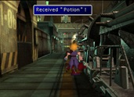 

As you move up the platform you will meet a pair of security guards that have come to investigate the commotion caused on the platform where you will be thrust into your first battle. In this battle you find yourself alone against a pair of guards. Press the  ) button to select the ATTACK commmand, then press it again to confirm the target as one of the guards. Each attack will take out one of the guards.

 

After successfully completing any battle, you will be awarded some experience (EXP) for your characters, some ability points (AP) for your materia, some gil and possibly some items.

After finishing the battle, continue up the train station and climb the stairs to the left.

Go north and talk to Biggs (the guy on the left). During the conversation, name yourself when prompted. Barret comes running in. Name him, and after a short FMV, you automatically enter the reactor compound. Follow the others north and west through the doorway.

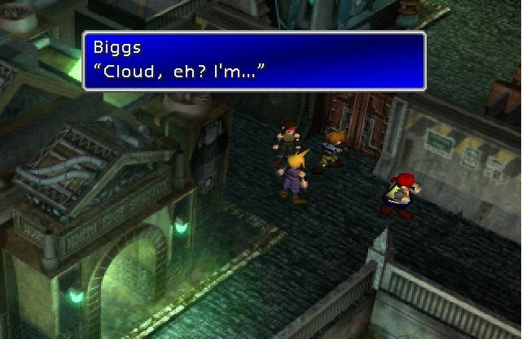 

> New Character: Biggs. 
> In this section we should write a bit about the new person we just met, also include a picture.
>
> New Character: Barret. 
> In this section we should write a bit about the new person we just met, also include a picture.

You are now on a catwalk high above the ground. When you come to a T-shaped junction, go north, into the reactor. 

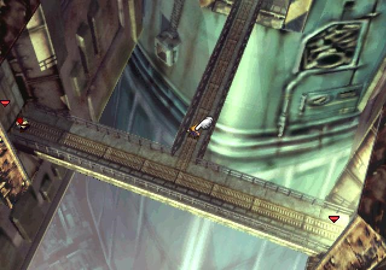 

Talk to Barret, and he joins your party.

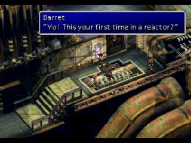 

There are two places that each party member can stand in during a battle, the front row, closest to the enemy, or the back row, further away. When a character is on the back row, they will receive less physical damage when attacked, but also cannot deal out as much damage. This is unless they have a long-range weapon! This means that they can dish out the pain whilst receiving much less in return! Barret fortunately does have a long-range weapon, so shuffle him onto the back row.

To do this, open the menu, choose Order, and then select Barret and select him again. This will swap the row he is on. Move him onto the back row (towards the right hand side of the screen).

 

Next, talk to Biggs (on the left) to open the door. Run through, and then talk to Jessie to open the next door. Before you enter the elevator search to the right for a chest with a Phoenix Down. Now talk to Jessie and enter the elevator.

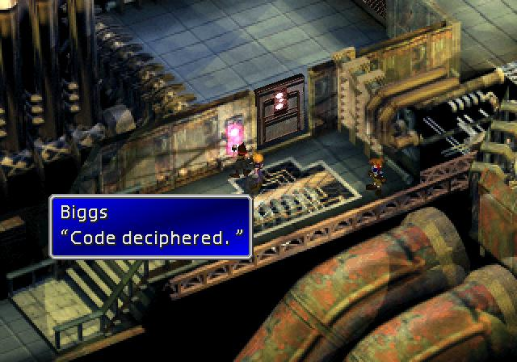 

Use the elevator to go down to the next level. While the elevator is going down, Barret explains a little more about the mission: the Mako reactors are using the valuable resources of the planet which will end up killing the planet one day! Cloud is rather ambivalent which serves to wind Barret up.

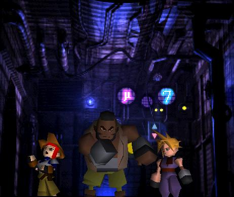 

Exit the elevator into a large room with stairs. Take the stairs down and right, then down and left, until you reach the ground.

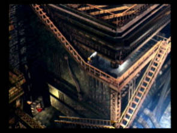 

Enter the door directly in front of you. Walk up to the gap to jump over it, and talk to Jessie. She explains how to use ladders.

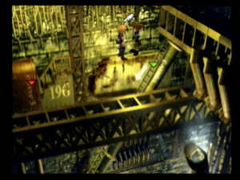 

Climb down, and then run towards Jessie. See the flickering blue thing by her feet? It's a Potion. Get it. Now run down the ladder on the right, and climb down the ladder next to the platform. Run down the pipe to the next screen.

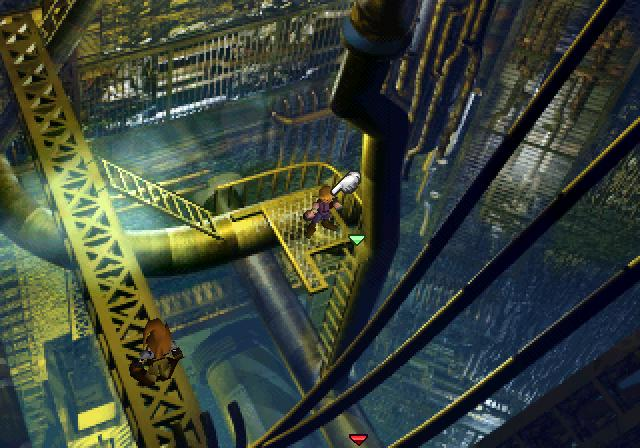 

Run down the pipes over the ladder on the wall. Here you encounter your first save point. Save your game. I suggest that you train your characters on this pipe heading over to the right side of the screen until your characters are level 7. If you can also get both characters’ limit break gauge full that would be perfect, but as close as possible to full will be good enough. Run down the walkway to the next area.

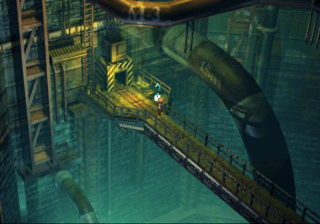 

Run up to the green dot on the ground. Pick it up; it's Restore Materia. You won't be able to use it until later.

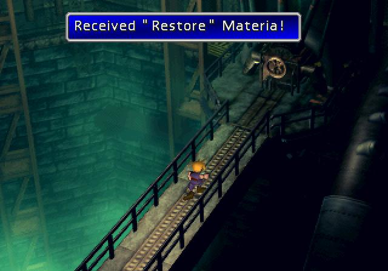 

 

|   |   |
|---|---|
| Name  | Guard Scorpion  |
| HP  | 800  |
| MP  | ??  |
| Level  | ??  |
| Strengths  | None  |
| Weaknesses  | Lightning  |

If you have either (or both!) characters limits ready, use them, this will deal out some serious damage early on.

The Guard Scorpion, being a robot, is susceptible to lightning. Have Cloud use Bolt repeatedly, while Barret attacks. Using this combination you should get around five rounds off attacks in.

 

When it raises its tail above its head, stop attacking, and cure with Potions if your HP is below 120 HP.

 

Your attack pattern now needs to change. Have Cloud to use Bolt the boss will then counter with its Tail Laser which will do around 100 HP’s of damage to anyone on the front row, whereas because Barret is on the back row he will only take around 50 HP’s. Have Barret use a Potion if either person’s health drops below 100 HP. What this attack will do for both characters is massively boost your limit gauges.

 

Limit breaks are powerful attacks, certainly worth using, but make sure that you can survive the counter attack - if not heal up using a potion.

| Rewards  |   |   |   |
|---|---|---|---|
| EXP  | AP  | Gil  | Item(s)  |
| 100  | 10  | 100  | Assault Gun  |

 

You now have 10 minutes to escape the reactor before it explodes, the first thing to do is equip the Assault Gun on Barret - with its higher damage it will help you kill off enemies quicker.

 

Run back to where you last saw Jessie on the pipes. Her leg is stuck, help her free it. Now you have to run back to the entrance, so re-trace your steps.

 

When you reach the entrance talk to Jessie, then Biggs, to open both doors. Just before you exit this area, you can raise your experience by fighting enemies until the timer is low, but not so low that you can't leave the area before the reactor explodes! 

## Navigation
[Previous chapter - TBD](/chapter_01.md) / [Next chapter - Sector 7 Slums](/chapter_03.md)
