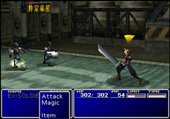

#  Midgar Sector 7 - Train Station & Reactor

## Story So Far

The Midgar express train has travelled around Midgar on its daily route. Arriving at the Train Station for the Sector 7 Reactor, among the usual hustle and bustle of passengers, a team disembarks with a purpose....

## Enemies encountered here

- Enemy A
- Enemy B
- Enemy C

## Items available here

You can find the following item(s) here:

- Potion x 4
- Phoenix Down x 1
- Restore Materia

## Guide

Disembarking the train in pursuit of your leader, use the D-pad whilst also pressing the  button so that you can run up the platform. You will see the disabled security guards on the floor, search them by pressing the  ) button twice in order to find two Potions.

 

As you move up the platform you will meet a pair of security guards that have come to investigate the commotion caused on the platform where you will be thrust into your first battle. In this battle you find yourself alone against a pair of guards. Press the  ) button to select the ATTACK commmand, then press it again to confirm the target as one of the guards. Each attack will take out one of the guards.

 

After successfully completing any battle, you will be awarded some experience (EXP) for your characters, some ability points (AP) for your materia, some gil and possibly some items.

After finishing the battle, continue up the train station and climb the stairs to the left.

Go north and talk to Biggs (the guy on the left). During the conversation, name yourself when prompted. Barret comes running in. Name him, and after a short FMV, you automatically enter the reactor compound. Follow the others north and west through the doorway.

 

> New Character: Biggs. 
> In this section we should write a bit about the new person we just met, also include a picture.
>
> New Character: Barret. 
> In this section we should write a bit about the new person we just met, also include a picture.

You are now on a catwalk high above the ground. When you come to a T-shaped junction, go north, into the reactor. 

 

## Navigation
[Previous chapter](/chapter_01.md) / [Next chapter](/chapter_03.md)
